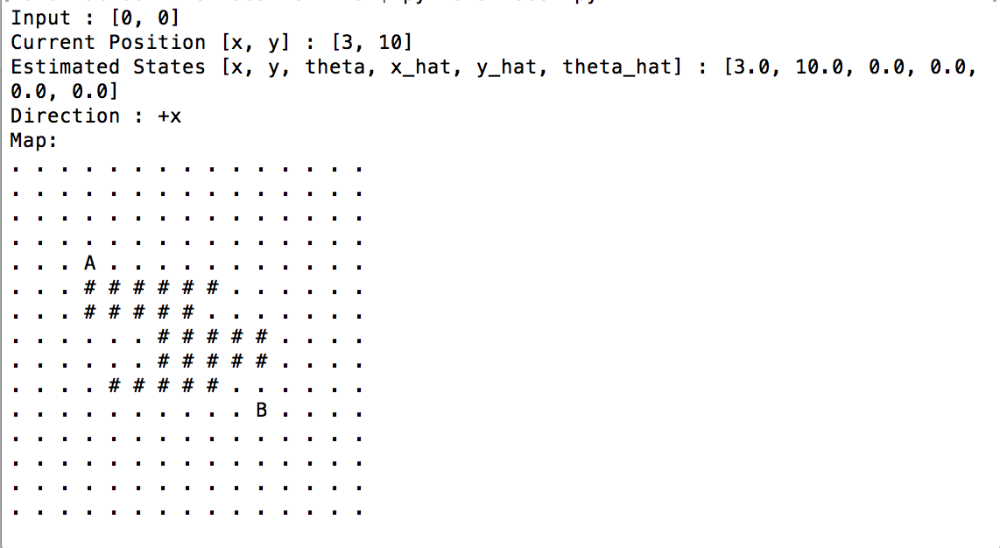

# Lab 5: Trajectory Planning Simulation
### Team Member: Zhuoran Duan, Zixuan Fan, Likai Wei  

Lab5 is a two wheeled robot trajectory planning simulation using Python. The Python script calculates the shortest path to the destination using Dijkstra's Shortest Path Algorithm. The state estimator of the lab is based on Extended Kalman Filter.  

### Usage
To run the code
```
python3 robot.py
```

In the script, robot.py, modify the line with desired values
```
Car = Robot(num_rows, num_cols, pos_start, pos_finish, direction)
```
The parameters num_rows and num_cols define the size of the discretization grid of the robot mapping.  
pos_start and pos_finish are tuples of the start and finish position, ex. (10, 10) for start position.  

The default direction of the robot is "+x", the positive x direction. To initialize the robot with different directions of the robot, pass values such as "-x", "+y", or "-y".  

The followings lines calculate the shortest path from start position to the destination and proceed one step at a time span 0.5s.
```
Car.calculate_path()
Car.automate()
```

#### Coordinates
The coordinates of the robot is based on the absolute coordinate of the grid, with the origin at the bottom-left corner.

#### Sample output


### License  
**MIT**

[//]: # (These are reference links used in the body of this note and get stripped out when the markdown processor does its job. There is no need to format nicely because it shouldn't be seen. Thanks SO - http://stackoverflow.com/questions/4823468/store-comments-in-markdown-syntax)


   [dill]: <https://github.com/joemccann/dillinger>
   [git-repo-url]: <https://github.com/joemccann/dillinger.git>
   [john gruber]: <http://daringfireball.net>
   [@thomasfuchs]: <http://twitter.com/thomasfuchs>
   [df1]: <http://daringfireball.net/projects/markdown/>
   [markdown-it]: <https://github.com/markdown-it/markdown-it>
   [Ace Editor]: <http://ace.ajax.org>
   [node.js]: <http://nodejs.org>
   [Twitter Bootstrap]: <http://twitter.github.com/bootstrap/>
   [keymaster.js]: <https://github.com/madrobby/keymaster>
   [jQuery]: <http://jquery.com>
   [@tjholowaychuk]: <http://twitter.com/tjholowaychuk>
   [express]: <http://expressjs.com>
   [AngularJS]: <http://angularjs.org>
   [Gulp]: <http://gulpjs.com>

   [PlDb]: <https://github.com/joemccann/dillinger/tree/master/plugins/dropbox/README.md>
   [PlGh]:  <https://github.com/joemccann/dillinger/tree/master/plugins/github/README.md>
   [PlGd]: <https://github.com/joemccann/dillinger/tree/master/plugins/googledrive/README.md>
   [PlOd]: <https://github.com/joemccann/dillinger/tree/master/plugins/onedrive/README.md>
